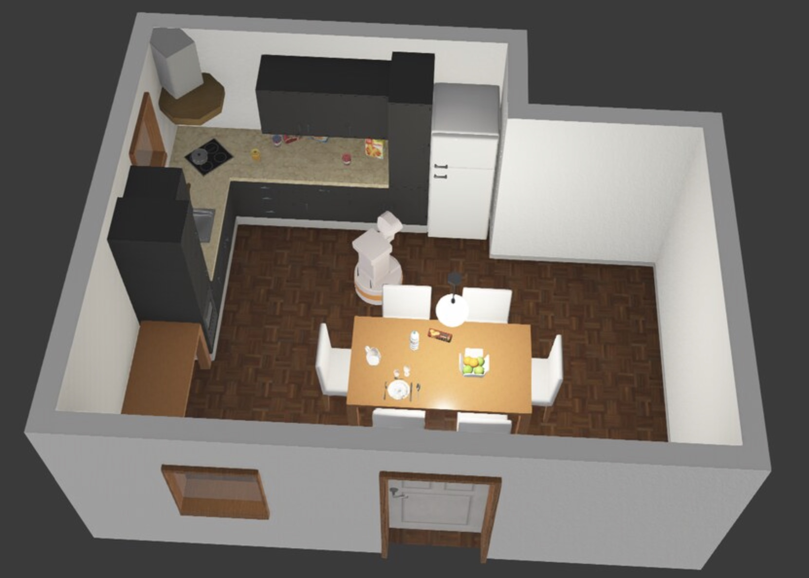
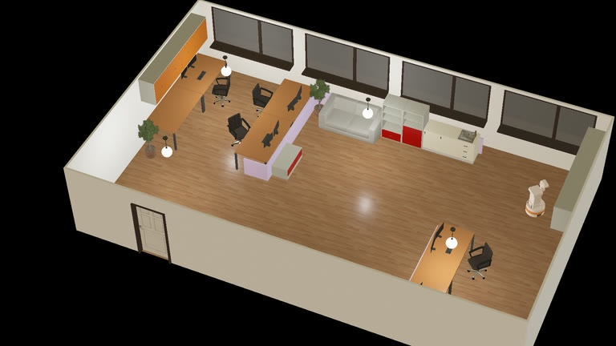
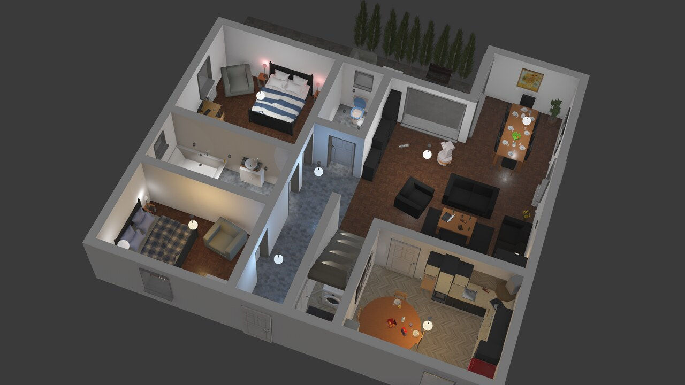

# robot-syswonder-webots_tiago

`robonix.robot.syswonder.webots_tiago` — Robonix deployment for the **Webots
TIAGo Lite** simulated robot. It runs the whole system end to end with no robot
hardware: differential-drive base, head RGB-D camera, planar lidar, and audio,
plus mapping, navigation, and exploration.



Bring up the simulator, boot Robonix against it, and drive the robot from
`rbnx chat` with requests like `go to room 101`, `what can you see?`, or
`explore the office`. This is the deployment the
[Robonix quickstart](https://robonix-book.syswonder.org/getting-started/quickstart)
walks through, and the fastest way to see the system work before putting it on
a physical body.

## Requirements

The simulator and several services run from the Robonix source tree, so a
`robonix` checkout is required alongside this repository. Point
`ROBONIX_SOURCE_PATH` at it:

```bash
export ROBONIX_SOURCE_PATH=/path/to/robonix
```

## Layout

```
robot-syswonder-webots_tiago/
├── sim/                       NOT a robonix package. Plain docker
│   ├── start.sh               compose stack (Webots + eaios_webots).
│   └── ...                    Bring up FIRST, before anything else.
├── boot.sh                    Variant-aware wrapper around rbnx boot.
├── soma.yaml                  TIAGo Lite body description (default).
├── soma.full.yaml             Full single-arm TIAGo body description.
├── primitives/                One device = one package.
│   ├── tiago_chassis/         /amcl_pose + /cmd_vel  → chassis/{state, move}
│   ├── tiago_camera/          /head_front_camera/*   → camera/{snapshot, depth_snapshot}
│   ├── tiago_lidar/           /scanner               → lidar/snapshot
│   ├── tiago_health/          nominal simulated battery/wheel/sensor health
│   └── audio_driver/          (separate, mic/spkr — old schema, not deployed yet)
├── services/
│   └── tiago_nav2/            Nav2 launch + ActionClient wrapper
└── robonix_manifest.yaml      Top-level deploy manifest.
```

Drivers run **inside** the sim container via `docker exec` so they share
the simulator's DDS graph. They are NOT host-side processes; the host
only needs `rbnx`, Docker, and an X11 display.

## Bring-up

Two terminals only:

```bash
# T1 — sim (Ctrl-C stops):
bash examples/webots/sim/start.sh

# T2 — robonix stack (whatever robonix_manifest.yaml declares):
bash examples/webots/boot.sh
```

`rbnx boot` from `examples/webots/` remains equivalent to the default Lite
command. The wrapper is required when selecting the full variant because it
keeps Soma and simulated health on the same robot description.

## TIAGo variants

The default `lite` variant is the existing TIAGo base and body without an arm:

```bash
# Terminal 1
bash examples/webots/sim/start.sh --tiago-variant lite

# Terminal 2
bash examples/webots/boot.sh --tiago-variant lite
```

The `full` variant uses Cyberbotics Webots R2025a `Tiago`: the same mobile
base and sensors plus its seven-axis front arm and default parallel gripper:

```bash
# Terminal 1 (keep this running)
bash examples/webots/sim/start.sh --tiago-variant full

# Terminal 2
bash examples/webots/boot.sh --tiago-variant full
```

The launcher automatically downloads the official Webots R2025a asset bundle
(about 661 MB) on the first full start; the Docker volume caches it for later
starts. Set `ROBONIX_WEBOTS_DOWNLOAD_ALL_ASSETS=0` only when the cache is
already populated by another method. Both terminals must use the same variant.
The full profile registers arm and gripper joint interfaces and reports their
nominal health, but it does not yet deploy a Robonix arm/gripper primitive, so
agent plans cannot command manipulation tasks yet.

W3D streaming clients resolve mesh and HDR URLs in the browser as well as in
Webots. The computer running the browser therefore needs direct or proxied
access to `raw.githubusercontent.com`; the server-side Docker cache does not
replace that browser requirement.

The sim launcher supports multiple built-in worlds:

```bash
bash examples/webots/sim/start.sh --world office.wbt
bash examples/webots/sim/start.sh --world apartment.wbt
bash examples/webots/sim/start.sh --world complete_apartment.wbt
bash examples/webots/sim/start.sh --world break_room.wbt
bash examples/webots/sim/start.sh --world kitchen.wbt
```

You can also pre-export `ROBONIX_WEBOTS_WORLD=<world>.wbt`.

`office.wbt` is the default. Its small, checksum-pinned cache downloads once
from the
[`syswonder/robonix-assets`](https://github.com/syswonder/robonix-assets/releases/tag/webots-office-seed-v3)
Release through `https://ghfast.top/` and is then reused from the persistent
Docker volume. For `apartment.wbt`, `complete_apartment.wbt`, `break_room.wbt`,
and `kitchen.wbt`, enable the official Webots offline asset bundle once:

```bash
ROBONIX_WEBOTS_DOWNLOAD_ALL_ASSETS=1 \
  bash examples/webots/sim/start.sh --world apartment.wbt
```

This downloads Cyberbotics' `assets-R2025a.zip` release asset through the same
mirror and stores it in the persistent Webots cache volume. Later runs reuse
the cache.

|  |  |
|---|---|
| `office.wbt`<br> | `apartment.wbt`<br> |
| `complete_apartment.wbt`<br> | `break_room.wbt`<br> |
| `kitchen.wbt`<br> |  |

Then a third terminal for `rbnx chat`. `rbnx caps` lists the
capabilities atlas knows about; `rbnx tools` lists the MCP tools
the LLM agent can call.

## Simulated hardware health

`rbnx boot` starts `tiago_health` during Soma stage 1. The primitive publishes
nominal battery, wheel, camera, lidar, and audio readings every 500 ms; Soma
maps those readings onto the component tree in `soma.yaml`. With the `full`
variant it also publishes all seven arm joints and the gripper against
`soma.full.yaml`.

The deployment manifest declares Vitals as a built-in system component, so
`rbnx boot` starts it automatically after Soma and Pilot. Soma uses `50091`
and voiceprint uses `50092` in this deployment, so Vitals listens on `50093`.

Confirm that Atlas sees it as active:

```bash
rbnx caps -v | rg vitals
```

Query the normalized result:

```bash
cd /path/to/robonix
PROTO_DIR=$(ls -td target/debug/build/robonix-vitals-*/out | head -n1)

grpcurl -plaintext \
  -import-path "$PROTO_DIR" \
  -proto robonix_contracts.proto \
  -d '{}' \
  127.0.0.1:50093 \
  robonix.contracts.RobonixSystemVitalsGet/GetVitals | jq
```

Expected power values are approximately `82%` and `24.8 V`; both wheels are
online with enabled torque and temperatures below the default thresholds.
The primitive's manifest config includes `scenario: normal`. This is the
reserved entry point for future fault profiles; unsupported values currently
fail initialization instead of returning misleading healthy data.

To tear everything down: Ctrl-C the `rbnx boot` terminal, OR from
any other shell:

```bash
cd examples/webots && rbnx shutdown    # SIGTERM each component's PGID
bash sim/stop.sh                       # then stop the Webots container
```

`rbnx shutdown` reads `rbnx-boot/state.json` (boot writes it
incrementally as components come up) and tears them down in
reverse order. Each chassis / camera / lidar / nav2 package's
`scripts/start.sh` installs a `trap` that pkills the in-container
python on EXIT/INT/TERM — so the docker-exec'd drivers don't
strand the next bring-up by holding ports 50111-50113 / 50211-50213.

## Env vars

Pre-export before `rbnx boot` (or set in shell rc):

```bash
export VLM_BASE_URL=https://api.openai.com/v1   # or your OpenAI-compatible endpoint
export VLM_API_KEY=sk-...
export VLM_MODEL=gpt-5.5
```

The deploy manifest references these via `${VLM_*}`.

## What `rbnx boot` does

1. Reads `robonix_manifest.yaml`, brings up the `system:` block (including
   Vitals) and the implicitly required Soma process using their installed
   binaries. Listen addresses, log levels, and VLM settings come from the
   manifest.
2. For each `primitive:` / `service:` entry, in declaration order:
   - Spawns the package via `rbnx start -p <path>` (which runs that
     package's `scripts/start.sh` — for tiago drivers that's a
     `docker exec` into the sim container that runs the Python driver).
   - Polls atlas until the package registers its first capability.
   - If the new provider declared a `*/driver` gRPC capability, also calls
     `LifecycleDriver.Driver(CMD_INIT, config_json)` to initialize it.
     Providers without a `*/driver` capability are deployed as soon as they
     register (no init dance) — tiago drivers fall in this bucket.
3. Sits on Ctrl-C / SIGTERM, then tears down all children.

## How the LLM picks tools

After `rbnx boot` is up, pilot's system prompt lists each provider's
`CAPABILITY.md` path; the LLM uses the executor's `read_file` builtin
to lazy-load the docs it needs (e.g. `read_file("/path/to/tiago_chassis/CAPABILITY.md")`).

Tools are exposed to the LLM as `<area>_<leaf>` to avoid leaf-name
collisions (camera and lidar both have a `snapshot` leaf — the LLM
sees `camera_snapshot` and `lidar_snapshot`). The MCP server inside
each driver still registers tools by leaf name.

The pilot's persistence prompt instructs the LLM to keep iterating
tools-then-reason until the task is *verifiably* done — taking a
fresh `camera/snapshot` after every physical action to confirm
progress.
